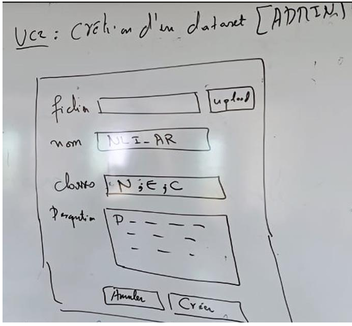
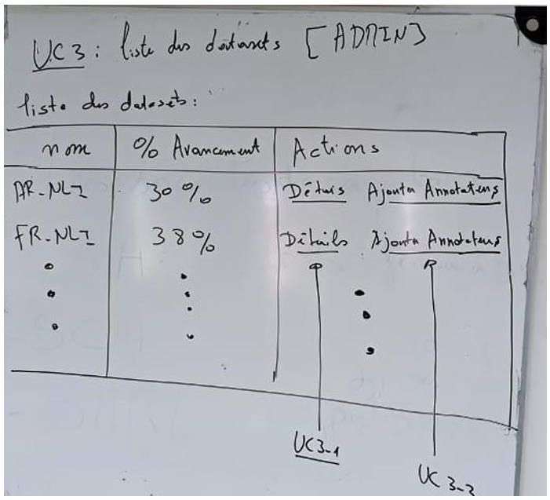
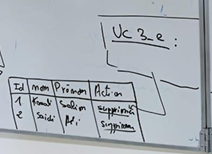
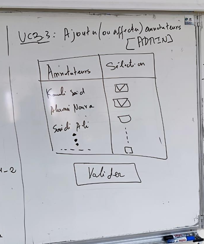
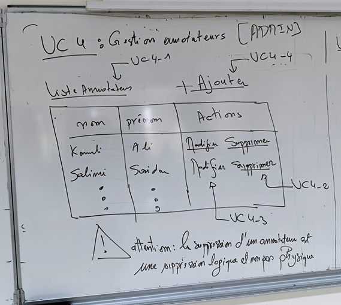
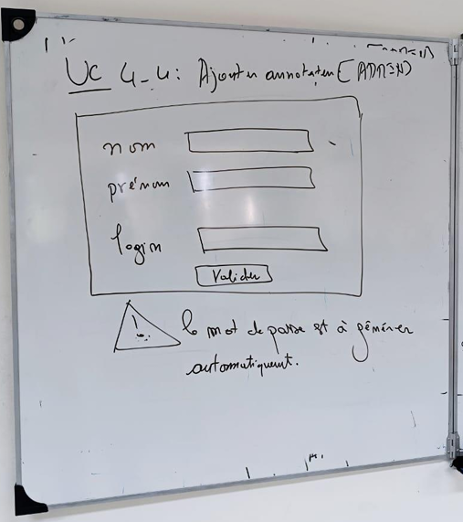
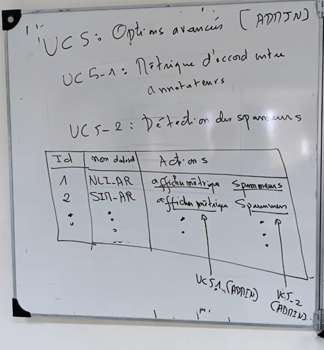
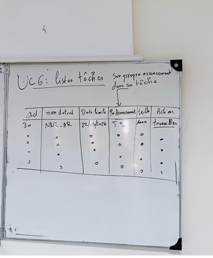
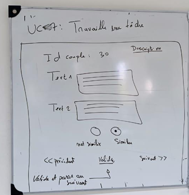
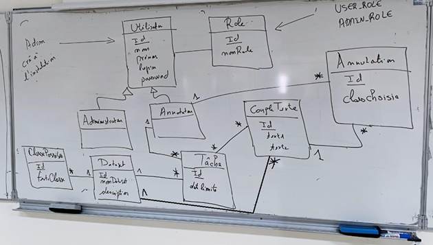

# 🎓 ECOLE NATIONALE DES SCIENCES APPLIQUÉES AL HOCEIMA (ENSAH)

# 🧠 Mini-Projet

## Plateforme intelligente d’annotation collaborative et d’apprentissage supervisé en Traitement Automatique du Langage Naturel (NLP)

📚 **Deuxième Année – Ingénierie des Données**
✍️ **Rédigé par :** Tarik BOUDAA
🏫 **École Nationale des Sciences Appliquées Al Hoceima**
📧 **Email :** [t.boudaa@uae.ac.ma](mailto:t.boudaa@uae.ac.ma)
📅 **Année Universitaire :** 2025/2026

---

# 📑 Sommaire

1. 🌍 Contexte
2. 🎯 Objectifs de l’application
3. 👥 Rôles des utilisateurs

   * 3.1 👑 Administrateur
   * 3.2 🏷️ Annotateur
4. ⚙️ Fonctionnalités principales

   * 4.1 📥 Importation des données
   * 4.2 📝 Annotation
   * 4.3 👤 Gestion des utilisateurs
   * 4.4 📊 Suivi & statistiques
   * 4.5 📤 Export des résultats
5. 🤖 Lancement de l'entraînement et du test des modèles NLP

   * 5.1 ✅ Fonctionnalités attendues
   * 5.2 🔗 Intégration technique
6. 🛠️ Contraintes techniques
7. 📦 Livrables
8. 🖼️ Maquettes des interfaces
9. 🗄️ Modèle de données

---

# 1️⃣ 🌍 Contexte

Ce projet vise à développer une application web intelligente permettant l’annotation collaborative de données textuelles dans le cadre des tâches de Traitement Automatique du Langage Naturel (NLP).

Les annotations collectées seront utilisées pour :

* ✅ Entraîner des modèles de Deep Learning
* ✅ Tester des modèles NLP supervisés
* ✅ Évaluer les performances des modèles
* ✅ Mesurer la qualité des annotations

L’application permettra à plusieurs annotateurs de collaborer sur un même dataset tout en assurant :

* 🔐 La sécurité des accès
* 📊 Le suivi des annotations
* 🧾 La traçabilité des actions
* 📈 Le calcul des métriques de qualité

---

# 2️⃣ 🎯 Objectifs de l’application

L’application doit :

* ✅ Permettre aux annotateurs d’accéder à une interface d’annotation ergonomique
* ✅ Fournir à l’administrateur des outils de gestion des utilisateurs
* ✅ Importer et gérer des datasets textuels
* ✅ Superviser l’avancement des annotations
* ✅ Exporter les résultats annotés
* ✅ Garantir la sécurité et la traçabilité
* ✅ Calculer les métriques de cohérence entre annotateurs
* ✅ Détecter automatiquement les annotateurs spammeurs

---

## 🧾 Types de datasets supportés

Chaque dataset peut être constitué :

### 🔹 D’un ensemble de textes simples

```math
\{T^i / i = 1,2,...\}
```

### 🔹 D’un ensemble de paires de textes

```math
\{(T_1^i, T_2^i) / i = 1,2,...\}
```

L’objectif est d’associer chaque exemple à une classe (catégorie/tag).

---

## 📌 Exemples de tâches NLP

### 🔹 Similarité textuelle

L’annotateur choisit entre :

* ✅ Similar
* ❌ Not Similar

---

### 🔹 Inférence textuelle (Natural Language Inference)

L’annotateur choisit entre :

* 🔵 Entails
* 🔴 Contradiction
* ⚪ Neutral

---

### 🔹 Analyse de sentiment

L’annotateur choisit entre :

* 😊 Positive
* 😡 Negative

---

## 🤝 Annotation multiple & qualité

Dans plusieurs tâches NLP, chaque exemple est annoté par plusieurs annotateurs (généralement 3 ou plus).

Cette redondance permet de :

* ✅ Capturer la subjectivité humaine
* ✅ Évaluer la qualité des annotations
* ✅ Mesurer l’agrément entre annotateurs

---

## 📏 Métriques de cohérence

Quelques métriques utilisées :

* 📊 Cohen’s Kappa
* 📊 Fleiss’ Kappa
* 📊 Autres métriques de cohérence

Dans cette application :

* ✅ Chaque texte est assigné à au moins 3 annotateurs
* ✅ Une interface administrateur affiche les métriques calculées

---

# 3️⃣ 👥 Rôles des utilisateurs

---

# 3.1 👑 Administrateur

L’administrateur peut :

* ✅ Créer, modifier et supprimer des comptes annotateurs
* ✅ Importer des datasets textuels (CSV, JSON, ...)
* ✅ Définir les catégories de classification (tags)
* ✅ Associer automatiquement les textes aux annotateurs
* ✅ Visualiser les progrès de chaque annotateur
* ✅ Exporter les résultats d’annotation
* ✅ Vérifier ou corriger des annotations
* ✅ Détecter automatiquement les spammeurs
* ✅ Afficher les métriques de qualité

---

## 📌 Exemple d’affectation

Pour un dataset contenant :

* 📄 100 000 textes
* 👥 10 annotateurs

Le système peut automatiquement affecter :

* 🔹 10 000 exemples à chaque annotateur

---

# 3.2 🏷️ Utilisateur (Annotateur)

L’annotateur peut :

* ✅ Se connecter à l’application
* ✅ Accéder à ses tâches d’annotation
* ✅ Annoter les textes
* ✅ Sauvegarder ses annotations
* ✅ Naviguer facilement entre les exemples
* ✅ Visualiser ses statistiques personnelles

---

## 📊 Statistiques personnelles

L’annotateur peut consulter :

* 📄 Nombre de textes annotés
* ⏱️ Temps moyen d’annotation
* 📊 Répartition des classes choisies

---

# 4️⃣ ⚙️ Fonctionnalités principales

---

# 4.1 📥 Importation des données

## 📂 Formats acceptés

* CSV
* JSON

---

## 📌 Champs minimum requis

* `id`
* `texte`

---

## ⚡ Fonctionnalités

* ✅ Répartition automatique des tâches
* ✅ Validation des données importées

---

# 4.2 📝 Annotation

## Fonctionnalités

* ✅ Interface simple et rapide
* ✅ Choix d’une classe par texte
* ✅ Sauvegarde automatique ou manuelle
* ✅ Navigation fluide entre les exemples

---

# 4.3 👤 Gestion des utilisateurs

## Fonctionnalités

* ✅ CRUD des annotateurs
* ✅ Attribution des textes à annoter
* ✅ Gestion des rôles et permissions

---

# 4.4 📊 Suivi & Statistiques

## Tableau de bord administrateur

Le tableau de bord doit afficher :

* 📄 Nombre de textes annotés
* 👥 Progression des annotateurs
* 📊 Distribution des classes
* 📈 Statistiques globales
* 📉 Statistiques individuelles
* 📏 Cohérence entre annotateurs

---

# 4.5 📤 Export des résultats

## 📂 Formats disponibles

* CSV
* JSON

---

## 📑 Colonnes exportées

* `id`
* `texte`
* `classe`
* `annotateur`
* `date_annotation`

---

# 5️⃣ 🤖 Lancement de l'entraînement et du test des modèles NLP

L’application doit permettre à l’administrateur de déclencher directement l’entraînement et le test des modèles NLP depuis l’interface web.

Cette fonctionnalité permet d’intégrer le processus d’annotation avec le développement des modèles d’intelligence artificielle.

---

# 5.1 ✅ Fonctionnalités attendues

## Depuis l’interface administrateur

### 🔹 Boutons pour :

* ▶️ Lancer un script Python d’entraînement (`train.py`)
* ▶️ Lancer un script de test/évaluation (`test.py`)

---

## 📊 Résultats affichés

* Accuracy
* F1-Score
* Confusion Matrix
* Logs d’exécution
* Graphes de performance

---

## 🕓 Historique des entraînements

Chaque exécution doit enregistrer :

* 📅 Date
* 👤 Utilisateur
* ⚙️ Paramètres utilisés
* 📊 Scores obtenus

---

## ⚙️ Paramétrage des hyperparamètres

Possibilité de :

* Modifier les hyperparamètres
* Utiliser un formulaire
* Utiliser un fichier de configuration

---

# 5.2 🔗 Intégration technique

## Communication Backend ↔ Python

Les scripts Python seront exécutés via :

* ✅ Appels système
* ✅ API REST
* ✅ Service intermédiaire

---

## 🔄 Communication avec Spring Boot

Le backend Spring Boot communiquera avec :

* 🐍 Un environnement Python (`venv`, `conda`, ...)
* 🌐 Ou un serveur intermédiaire

---

## 💾 Gestion des résultats

Les résultats seront :

* enregistrés dans la base de données
* ou affichés directement dans l’application

---

# 6️⃣ 🛠️ Contraintes techniques

| Partie              | Technologie     |
| ------------------- | --------------- |
| ⚙️ Backend          | Spring Boot (REST API) |
| 🎨 Frontend         | React           |
| 🗄️ Base de données | MariaDB / MySQL |
| 🔐 Sécurité         | Spring Security |
| 🐍 IA / NLP         | Python          |

---

# 7️⃣ 📦 Livrables

Les livrables attendus sont :

* ✅ Diagramme de classes
* ✅ Code source complet
* ✅ Base de données
* ✅ Documentation
* ✅ Vidéo de démonstration

---

# 8️⃣ 🖼️ Maquettes des interfaces

---

# 🔐 Authentification

Après authentification, l’utilisateur est redirigé selon son rôle :

* 👑 Administrateur → Liste des datasets
* 🏷️ Annotateur → Liste des tâches

---

# 👑 Interfaces Administrateur

---

# 📂 Création d’un dataset

L’administrateur peut :

* ✅ Sélectionner un fichier dataset
* ✅ Définir le nom du dataset
* ✅ Définir les classes possibles séparées par `;`
* ✅ Ajouter une description optionnelle

---



---

# 📋 Liste des datasets

L’administrateur peut afficher tous les datasets existants.

---



---

# 🔎 Détails d’un dataset

Cette interface permet d’afficher :

* 📄 Les informations du dataset
* 🔤 Les couples `(Text1, Text2)`
* 👥 La liste des annotateurs

---

## Fonctionnalités disponibles

* ✅ Désaffecter un annotateur
* ✅ Conserver les annotations déjà réalisées

---


---

---

# 👥 Affectation des annotateurs

L’administrateur sélectionne plusieurs annotateurs puis valide l’affectation.

Le système :

* ✅ Distribue automatiquement les couples à annoter
* ✅ Crée les tâches pour chaque annotateur

---



---

# 👤 Gestion des annotateurs

Fonctionnalités disponibles :

* ➕ Ajouter
* ✏️ Modifier
* ❌ Supprimer
* 👀 Consulter

---



---

# ➕ Ajouter un annotateur

Interface de création d’un compte annotateur.

---



---

# ⚡ Options avancées

Fonctionnalités avancées :

* 🚨 Détection des spammeurs
* 📏 Calcul des métriques de qualité

---



---

# 🏷️ Interfaces Annotateur

---

# 📋 Liste des tâches affectées

Après connexion, l’annotateur visualise ses tâches assignées.

---



---

# 📝 Travailler une tâche

L’annotateur peut :

* 📖 Lire le texte
* 🏷️ Choisir une classe
* 💾 Sauvegarder l’annotation
* ➡️ Passer au texte suivant

---



---

# 9️⃣ 🗄️ Modèle de données

## 📌 Règles métier

* ✅ L’application possède un seul compte administrateur
* ✅ L’administrateur peut créer plusieurs annotateurs

---

## 🔐 Rôles à créer manuellement dans la base de données

* `ADMIN_ROLE`
* `ANNOTATOR_ROLE`

---

- `Modèle de données`

